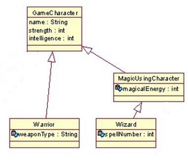

# Grand Circus Lab 5.1 RPG
## Task
Implement polymorphism for a fantasy role-playing game.

## Build Specifications
Consider the following class structure:

1. Implement each one of the classes you see in the figure. Code fields as private, make public properties for each, and write the constructors. Add a method called “Play” at the GameCharacter class, which outputs to the Console the Name of the Character and shows the strength and the intelligence.
1. You need to override the Play method at the Warrior, MagicUsingCharacter, and the Wizard classes. Each method should print all the properties of that class (including the inherited ones).
1. In the main, create a List of type GameCharacter and call it “gameCharacters”, and then add: Two Warriors and three Wizards. After that, do a for loop to invoke the Play method for all the objects in that array.

## Grading Standards (Graded out of 15)
* GameCharacter Class
    * Has all fields indicated (private) and properties for them 1 point
    * Has all-arguments constructor 1 point
    * Has Play method (can be empty, but proper header) 1 point
* MagicUsingCharacter Class
    * Extends GameCharacter, has appropriate field & property 1 point
    * Has all-arguments constructor 1 point
    * Overrides the Play method 1 point
* Warrior Class
    * Extends MagicUsingCharacter, has appropriate field & property 1 point
    * Has all-arguments constructor 1 point
    * Overrides the Play method 1 point
* Wizard Class
    * Extends GameCharacter, has appropriate field & property 1 point
    * Has all-arguments constructor 1 point
    * Overrides the Play method 1 point
* Main method (Program Class)
    * Creates a List of GameCharacters 1 point
    * Property instantiates 3 Warriors and 1 Wizard and adds them to the list 1 point
    * Loops through List and invokes Play method for each 1 point
